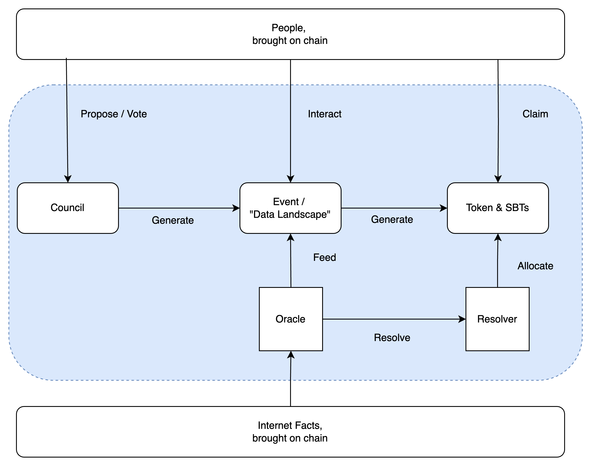

# DeMonitors

*DeMonitors is a portal, to the boundless vistas of the "Internet landscape".*

Crypto is still a few strides away from mass user adoption, and it's not just about TPS or scalability metrics, nor the never-ending quest for user-friendliness.

Crypto needs diversity.

And people crave it.

DeMonitors is committed to bringing the pulse of the internet - events and attitudes - onto the blockchain.

Because the internet is a constant flurry of facts and happenings. These real-time data points not only enrich chains' dataset but also personify blockchain addresses through their interactions.

DeMonitors builds an internet landscape rooted in event data, leveraging the internet as the infrastructure to propel Crypto into the **mass user adoption**.

---

## Architecture

The streamlined architecture of DeMonitors is as follows.

Selected by community voting, DeMonitors will construct "Oracles" for internet events' data, channeling that data onto the blockchain. These events could range from philanthropic initiatives to sports competitions or social happenings, with the event data visualized as an "internet landscape".

Users interact with this "landscape" to appraise and express stances on events, or even predict trends. Picture this: a blockchain-based IMDB revolving around an endless stream of factual events.

This user engagement feeds back into the system, earning users SBTs compliant with the Token-2022 standard, which serve as identity markers for other social protocols on the blockchain.

In tandem, Tokenomics rewards users with tokens that flow back into staking and community voting, nurturing the next internet event landscape and creating a positive feedback loop—a virtuous flywheel.

