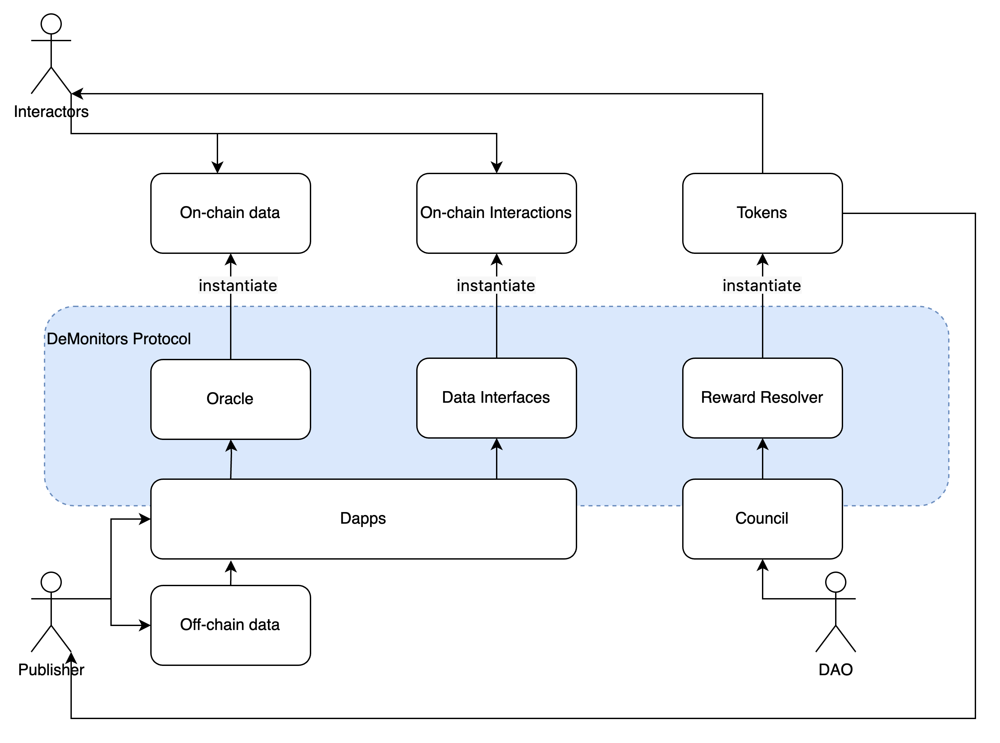
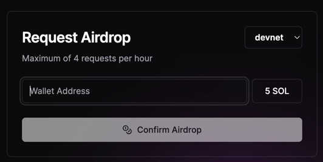
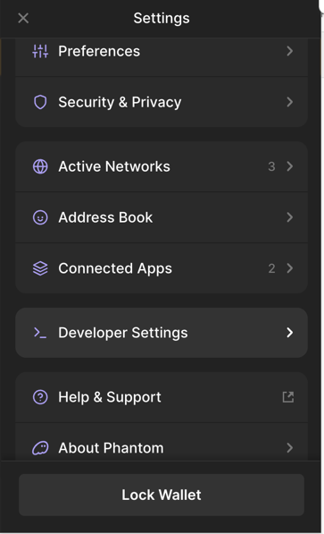
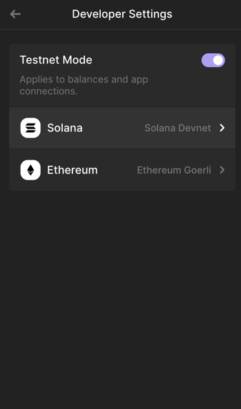
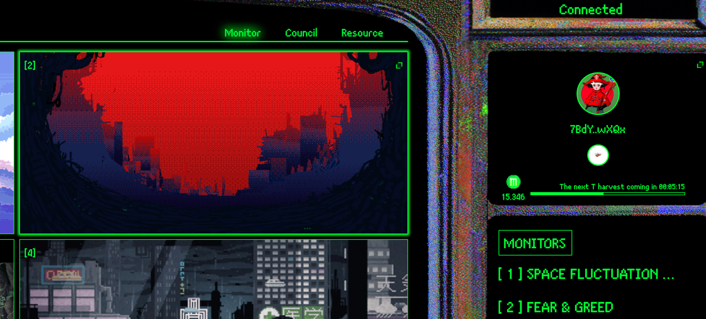
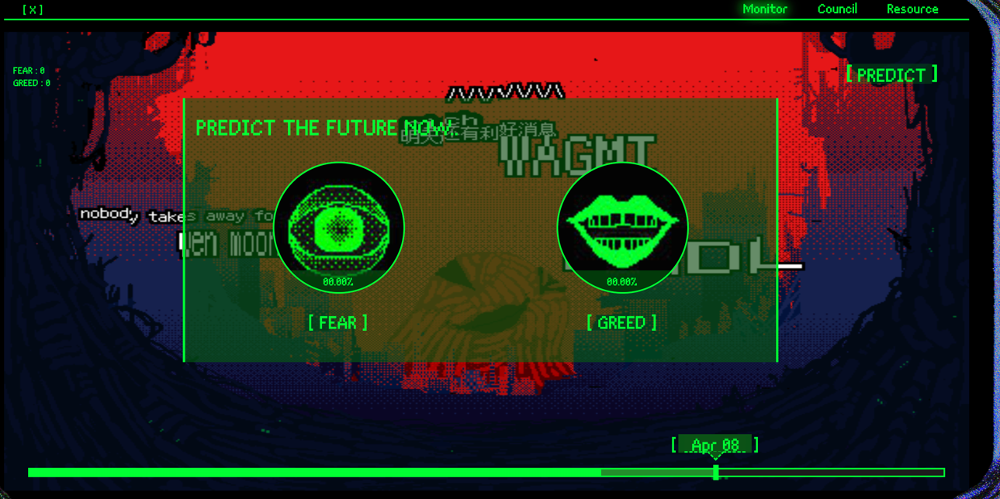
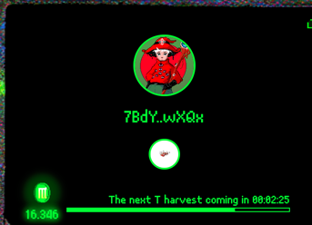

# DeMonitors

*[DeMonitors](https://demonitors.xyz/) is a decentralized data curation protocol.*

DeMonitors enables users to publish data on the blockchain and define interactions with it. Its incentive mechanism rewards both data publishers and interactors. The protocol aims to promote blockchain diversity and drive widespread user adoption.

---

## Architecture

The DeMonitors protocol consists of three parts:

Data Publishing, Interaction Definitions, and Reward Mechanisms.

Publishers can push off-chain data onto the blockchain through the DeMonitors protocol or other Dapps based on the protocol, while also defining a set of interactions for the data. These will be instantiated based on the DeMonitors protocol standards.

Interactors can engage with the data through these methods of interaction.

The DAO and DeMonitors protocol will define incentive mechanisms for both publishers and interactors based on the frequency and nature of interactions. Interactors will also receive a special kind of NFT Token, these are SBTs based on Token 2022, and their Metadata will serve as on-chain tags for these native address accounts.

This is consistent with the underlying logic of many internet content creation platforms. The difference is that we define "content" as the most atomic data on the blockchain.

## An APP for example

The [DeMonitors site](https://demonitors.xyz/) is an application instance based on the DeMonitors protocol. 

This app creates a data landscape using internet data.

In the data publishing segment, we have the Fear and Greed Index, which oracles bring onto the blockchain.

For data interaction, the app not only displays a real-time rendered landscape but also offers a prediction market for future index values.

In the incentives part, settling in the prediction market grants users Token 2022 standard SBTs and tokens, with the SBTs also representing their on-chain persona.

Within this landscape, we've also integrated AI-driven news feeds and a visual mining feature that generates tokens simply by engaging with the scenery.

The tokens earned by users flow into the Council where, through staking and voting, they trigger the construction of the next internet landscape.

### How to interact with it?

**1. Claim devnet Solana at https://faucet.solana.com/**

**2. Set your wallet to devnet mode. (In Phantom)**

**3. Visit https://www.demonitors.xyz/monitor and connect your wallet**

*Interacting with this site, your wallet might alert you to potential security risks. Rest assured, all interactions are secure. These security prompts are due to our information not yet being registered with third-party security organizations. The contract code for the site is open source and available for review.*

*Nonetheless, we encourage you to interact with this site using a new wallet address. This is a good practice when engaging with projects on the devnet network.*

*4. Visit the Fear and Greed Index internet landscape, where you can browse historical data and make predictions about the data for a future date.*

*5. Receive token incentives when the prediction results are revealed.*

*6. Earn screen mining rewards by simply staying on the page.*

