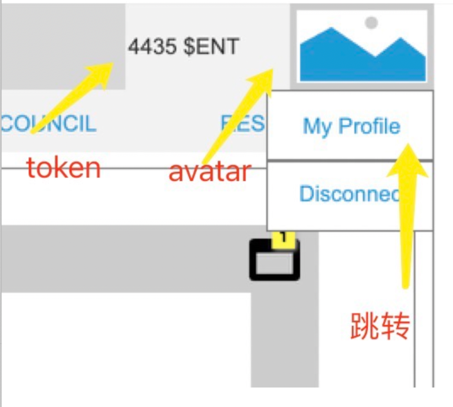
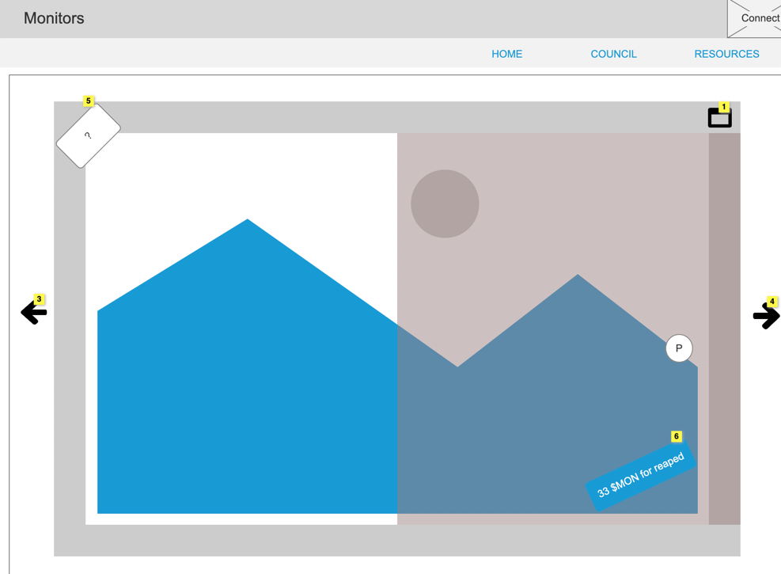
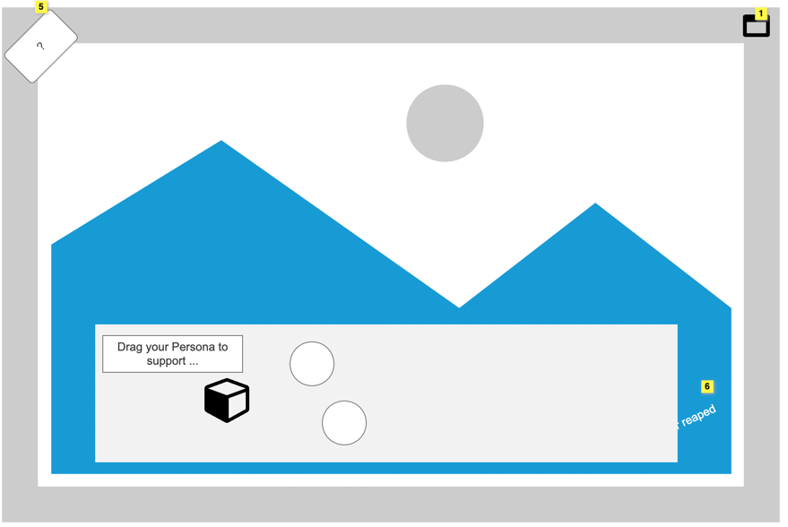
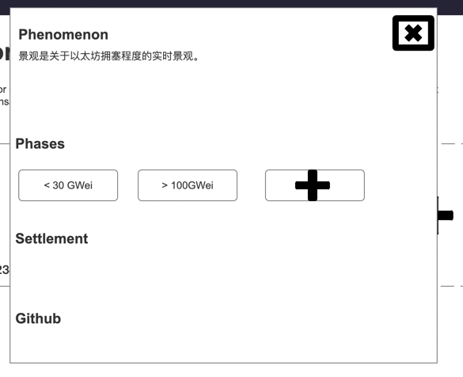

# PRD

[ioc]

## 背景

本项目是一个区块链上的艺术概念项目，项目在视觉上由若干的“互联网景观”构成。

一个“互联网景观”，是其相应的**互联网事件**的视觉化，譬如用抽象的视觉意象来表现：市场的行情走势、生态系统的变化、体育比赛情况或者政治竞选的进展等。

景观化的过程是：这些互联网事件的数据被通过预言机持续发布到链上，“互联网景观”们根据链上数据的变化随之有形态的变化。

.

用户可以与这些“互联网景观”来交互。用户可以通过其拥有的数字资产来质押在“互联网景观”之上，用来表达对于该互联网事件走势的预测，或是表达用户自己的态度，交互行为会根据规则让用户获取项目Token的激励。

这些Token用于社区内的治理，供社区成员发起新的“互联网景观”的建设提议，投票通过后，景观建设方将互联网事件建设为“互联网景观”。

.

另外，项目具有艺术概念之上的另一层价值。

因这些互联网事件数据以及围绕互联网事件事件的用户交互数据，被输出到区块链上，为事件带来了去中心化和去审查的永存记录，为链生态带来了Web3链上社交身份的重要人格化数据。项目可以成为区块链网络中其他协议应用或自身拓展场景的数据基石。

---

*本文档为项目的产品描述，以故事维度刻画需求。*

*项目的线稿请参见[项目线稿RP](https://x0nfcc.axshare.com) ，仅服务于产品功能的表达，不构成任何UI和UX意见。*

---

## 技术前提

- 考虑项目投入Gas成本消耗、VC、Grant资源，选择Solana区块链承载项目。

## User Journey

1. 用户访问Monitor的站点时，可以第一时间看到一个占据大部分屏幕区域的“互联网景观”。 
   - 用户可以看到“景观”侧（或“景观”上）的文案，了解到这个“景观”是表达什么互联网事件/数据。
   - *用户也可以用左右的箭头切换到不同的场景。* **[弱优先级需求]**
   - *用户可以最大化景观。* **[弱优先级需求]**

2. 站点需要用户链接TA的区块链钱包才能交互。
   - *如果用户没有链接钱包，任何与区块链的交互都需要弹出Toast来暗示用户链接钱包。* **[弱优先级需求]**
   - 用户可以点击右上角的Connect，来选择链接哪个钱包，在选择钱包后，将唤起钱包connect。
   - 在成功链接之后，右上角的Connect将变成一个头像，同时左侧会显示用户的项目治理代币的余额。
   - 用户点击头像后，会出现下拉菜单，可以让用户断开链接，或者跳转到Profile页面
   

3. 用户可以看到画面上有可交互的元素： 
   1. 其中有一个可交互元素对应了**屏幕挖矿**
      （即：伴随着用户的屏幕停留事件，会为用户持续累计token激励）。
      - UI以清晰的方式让用户理解，这个交互会带来token回报
      - 用户可以和这个元素交互来获取Token收益，交互中用户可以得到收获的动画效果作为反馈。
      
   
   2. 其中也有可交互的元素对应了景观两种（多种）趋势的力量，用户可以与之交互。
   
      - 交互后，屏幕将蒙版显示用户的道具栏，这里面将显示用户拥有可以与景观交互的NFT资产 **[具体展示效果和动画效果弱优先级需求]**
      - 用户可以拖动自己NFT资产到景观中，在景观中质押 **[具体展示效果和动画效果弱优先级需求]**
      - 用户若已经放置了NFT资产到景观中，应该在UI看到对应的反馈（不一定要在景观中显示NFT本身，但需要让用户明晰知道这时已经质押的状态）
      - 用户在景观里的NFT资产，可能会为用户带来Token回报。UI应以清晰的方式让用户理解，这个交互会带来token回报
      - *用户可以将已经放置到景观中的NFT资产回收到道具栏中* **[弱优先级需求]**

4. 用户在council页面可以质押（Stake）自己拥有的治理代币，来获取投票的票力。
   - 用户在拥有投票票力后，可以发起对于新建景观的提案。
   - 发起提案会新打开一个同页面的小窗，展示一些需要填写的文字信息（文案另定）
   
   - 已经创建的提案，会显示在站点上，同时这个提案方框要有一些信息的渲染来暗示功能，无需做点进去的表单和画面

5. 用户可以在Profile页面上，看到自己拥有的NFT资产，在一个美术化呈现的类似背包中。 **[具体展示效果和动画效果弱优先级需求]**

---

**以下内容待更新到最新**

## 技术stories

### S1. 预言机

- [?] Demo的互联网景观需要确认
  + 恐惧贪婪指数？
- [?] 制作的景观数，考虑成本建议做一张，美术可多提供几张静态图充实内容

在站点的首页，提供了各个“互联网景观”，用户可以在页面切换浏览。
需要实现“互联网景观”的原始数据获取和归类，发布到链上。 前端读取链上数据，通过美术提供的脚本或素材将动态视觉展现在网页上。

#### 工作分解

**美术**

- Demo互联网景观的图
  - 需要动态、两～三种形态（根据景观本身特质）

**UI**

- 框架
- 首页
  - 场景切换

**后端**

- 获取互联网景观的网络数据并归类
  - [?] 使用Langchain和LLM来进行数据推断和归类，时间不足的话直接获取外部Index数据
- 和合约进行交互，通过计划任务写入数据

**合约**

- 实现预言机合约逻辑
  - 提供读取和写入的方法

**前端**

- 与合约进行交互，读取数据
- 调用美术提供的脚本进行渲染
- 实现UI的其他动画预期

**工时预计**

后端+合约 3.5d

### S2. 链接钱包

站点允许用户链接web3钱包，以进行后续的交互。

#### 工作分解

**UI**

- 链接/断开钱包按钮
- 钱包选择列表
- 链接态的展示/NFT获取的头像展示

**前端**

- 使用solana-web3js，对接Phantom等区块链钱包。

**工时预计**

后端+合约 0d

### S3. 铸造

在站点的Factory页面上，可以铸造PlugmanNFT。
交互可加入更多的风味，使之更符合项目的美学设定。

#### 工作分解

**美术**

- Factory页面美术图样
- NFT的风格展示，动画等等
  
**UI**

- Factory页面
    - 标签和toast条提示等

**合约**

- NFT合约、脚本的初始化
- Metadata的设置

**前端**

- 调用合约完成铸造

**后端**

- 可能存在的数据需求

**工时预计**

后端+合约 1.5d

### S4. 预测市场的发起预测（NFT Holder）

在站点的首页页面上，NFT的Holder可以在一个互联网景观上，与景观交互，来发起对于下一个检查时点的走势预测。
一般地，景观可以预测的走势为两个或者三个。此处以比赛为例：比赛的结果可以是主队的胜、平或者负。

#### 工作分解 

**美术**

结合Plugman，做在景观植入融合的体现。

**UI**

- 首页页面上的景观，需要可以让Plugman互动插入的地方
- [?] 选取哪个NFT进行互动的弹窗界面。Demo时期，可以考虑不做
- 质押后的页面展示

**合约**

- 预测市场的合约
- 质押NFT的功能
- 收益计算逻辑

**后端**

- 供给前端展示的辅助性需求

**前端**

- 对接合约，完成NFT的质押，预测下注

**工时预计**

后端+合约 4d

### S5. 预测市场的发起预测（Token Holder的Delegate）

- [?] *此需求较为复杂，在Demo展示阶段不做考虑*

在站点的首页页面上，Token的Holder可以在一个互联网景观上，与景观交互，来发起对于下一个检查时点的走势预测。
Token的Holder实质上是Delegate到下注的NFT上，在预测成功时，Token Holder与NFT Holder分享Token收益，在预测失败，Token Holder损失质押的Token。这些Token被销毁。

**工时预计**

后端+合约 0d

### S6. 预测市场的获取收益

在站点的首页页面上，NFT Holder / Token Holder可以获取其预测正确带来的Token收益。

#### 工作分解

**UI**

- 首页页面上的景观，可以让已质押的NFT Holder和景观或景观上的物件来查看并获取收益

**合约**

- 治理代币的相关合约实现
- 预测市场收益分配和合约实现

**后端**

- 供给前端展示的辅助性需求

**前端**

- 对接合约，完成代币收益的结算

**工时预计**

后端+合约 1.5d

### S7. 治理代币的Governance - 代币的质押

在站点的council页面，治理代币的Holder可以质押治理代币，将之转化为投票的票力。质押的治理代币进入锁定状态，需要一定的时间周期才可以解锁。
治理代币的Holder可以解除过了锁定期的治理代币。

#### 工作分解：

**UI**

- 在council页面，需要设计Stake/Unstake的Dashboard，和相关行为的交互方式。

**合约**

- 治理合约的相关实现

**后端**

- 供给前端展示的辅助性需求

**前端**

- 对接合约，完成代币的质押/解除质押

**工时预计**

后端+合约 2d

### S8. 治理代币的Governance - 提案与投票

在站点的council页面，NFT的Holder且拥有投票票力的用户可以发起提案，以发动对于新生事件的互联网景观建设。

#### 工作分解：

**UI**

- 在council页面，具备条件的用户可以发起新的提案，或对于提案进行投票。

**合约**

- 提案、投票合约的相关实现

**后端**

- 提案的数据信息整理签名
- 第三方Program和系统的整合
- 前端需要的数据归集与提供

**前端**

- 对接合约和后端，让用户可以发起新的提案，进行投票。

**工时预计**

后端+合约 3d

### S9. 新互联网景观的协议层实现

- [?] *此需求较为复杂，在Demo展示阶段不做考虑*

通过投票结果和协议层，可以让新互联网景观的建设团队筹建景观，并纳入项目全景。

### S10. Resources页面

在站点的Resources页面，提供项目的资讯、blog、设计与技术文档和插件工具的下载。

#### 工作分解：

**文案**

**UI**

**后端**

**前端**

**工时预计**

后端+合约 0.5d

### S11. 项目的文案需求

为体现项目的概念、设定和风味，需要准备项目文案，并围绕之进行UI和页面设计。

#### 工作分解

**文案**

**UI**

**工时预计**

后端+合约 2d

