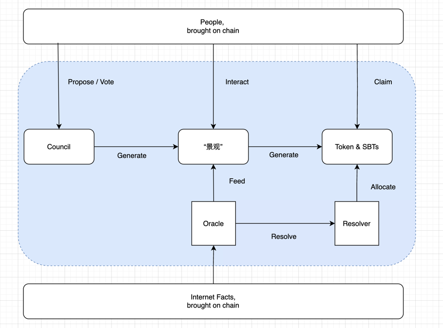

# Presentation Scripts

**[语言 - 英文]**
**[字幕 - 中英文]**

### [Part 1]

**[演示者屏幕 - 首页景观 ｜ 演示者摄像头 ]**

**[时长 - 20s]**

我们是monitors项目团队，我们项目的目标是推动Crypto的大规模用户实践。

目前没有哪个项目真正成功做到了这一点。我们认为，若能做成这一点，需要无限吸纳互联网数据，让互联网成为基础设施。

---
(剪辑分割)

---

### [Part 2]

**[演示者屏幕 - 架构图 ｜ 演示者摄像头]**

**[时长 - 40s]**(待精粹)

通过社区投票遴选，Monitor将修建事件预言机，以把互联网事件数据带到链上。这些事件可以是公益项目、赛事或社会事件，事件数据被视觉化为互联网景观。

用户可以与景观交互，来完成对于事件的评价、表态甚至趋势预测。想象一下，链上正在修建一套围绕无限事实的IMDB。

这些用户的互动反馈，将为用户带来Token-2022标准的SBT，这会成为用户的身份标签，供给链上的其他社交协议。

同时，tokenomics也将给予用户token，这些token将流入社区投票，营建下一个互联网事件景观，形成一个正向飞轮。

---
(剪辑分割)

---

### [Part 3]

**[演示者屏幕 - 首页景观 ｜ 演示者摄像头 ]**

**[时长 - 2m 35s]**

目前展示的，是恐惧贪婪指数的互联网景观。恐惧贪婪指数通过预言机喂入链上，而互联网景观通过链上数据渲染视觉画面。

这个被艺术家架空构造的世界被称为第四象限，运行着超一般认知的逻辑，你可以从背景氛围、未知生物的态度中感知加密市场的动态。

(鼠标指向时间戳和rawdata)这是这一刻，由数值79(具体替换为当时的数值)渲染的世界。拖动时间轴，我们可以回溯历史的景观动态，也可以拖动到未来，这时用户就可以和景观进行交互，用户可以预测未来市场是会变得更恐惧还是更贪婪。

(鼠标点击预测并完成交互) 而未来景观的渲染，是基于链上用户的预测反馈数据。(指向投票数据)

---
(剪辑分割)

---

(鼠标点击claim并完成交互)  在景观事件被resolve后，resolver会根据判定逻辑反馈给用户token，以及基于Token 2022标准的SBT。

(鼠标指向User框的SBT) 这些SBT带有monitor特殊的metadata，是用户行为带来的身份标签，也是用户可以与景观进行交互的Agent。

(鼠标指向 Token Harvest)而另一类和景观的交互是静默的。只要你停留在景观页面，前后端和Solana Program会为用户计算token收益，我们称之为视觉挖矿。

(点击缩略，显示4个景观)monitor有更多景观，来自不同的互联网数据源，有不同的用户交互和resolve方式。

(点击council)monitor将会有更多景观，来自于tokenomics赋能的治理，来自于策展网络、艺术家群体和我们社区。

(点击resources，这里应该有且仅有一个联系方式的信息)谢谢。

(结束)